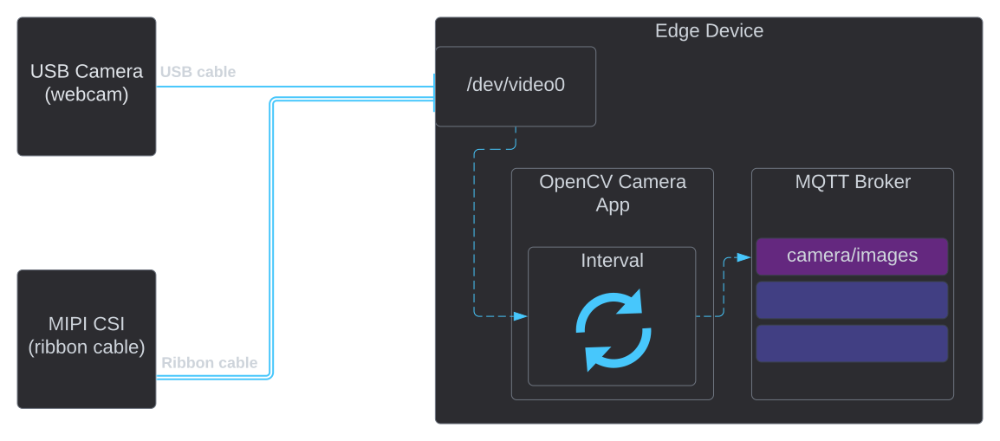

# OpenCV Camera App
The OpenCV Camera app collect images from cameras connected to the device.

## Overview

The most simple app to ingest images into a message stream with a fixed interval. The app use cameras connected directly
to the edge device with USB or MIPI CSI(ribbon style cable).

{ width="800" }

## Start streaming images

Select the device id of the camera peripheral connected to the edge device. `DEVICE_ID` set the id of the device as a number
, for example `0` will refer to `/dev/video0`. 

Finding out what id your camera has might not be straight forward. If you only have one camera attached it most likely 
will be the default device id `0`. If you want to look into it, you can use command line tools like this for example:

```bash
sudo apt-get install v4l-utils
v4l2-ctl --list-devices
```

### Output

Output can be sent to the MQTT Broker on a custom topic. The topic is set by the variable `MQTT_OUT_0`.

#### MQTT Message Format

The message format only has one JSON element called payload, which contains the image data. The image is encoded with MIME,
base64 encoding for the JPEG image. This is the default for most image-generating apps from Teknoir.

This example is truncated and does not show the full MIME image data:
```json
{
  "payload": "data:image/jpeg;base64,/9j/4AAQSkZJRgABAgAAAQABAAD/4QErRXhpZgAASUkqAAgAAAAFAA8BAgAFAAAASgAAABABAgAGAAAA..."
}
```

## Settings

| Var                 | Description                                      | Default          |
|---------------------|--------------------------------------------------|------------------|
| `MQTT_SERVICE_HOST` | MQTT Broker Host                                 | mqtt.kube-system |
| `MQTT_SERVICE_PORT` | MQTT Broker Port                                 | 1883             |
| `IMAGE_INTERVAL`    | Seconds between update                           | 1.0              |
| `MQTT_OUT_0`        | The MQTT topic to publish images to              | camera/images    |
| `DEVICE_ID`         | The video device number, `0` means `/dev/video0` | 0                |
| `IMAGE_WIDTH`       | The width of the image output                    | 800              |
| `IMAGE_HEIGHT`      | The height of the image output                   | 600              |

## Advanced

The Kubernetes deployment for this app can look like this:

```yaml
apiVersion: apps/v1
kind: Deployment
metadata:
  name: camera
spec:
  replicas: 1
  selector:
    matchLabels:
      app: camera
  template:
    metadata:
      labels:
        app: camera
    spec:
      containers:
        - name: camera
          image: gcr.io/teknoir/camera_cppcv:arm64v8
          imagePullPolicy: IfNotPresent
          env:
            - name: MQTT_SERVICE_HOST
              value: "mqtt.kube-system"
            - name: MQTT_SERVICE_PORT
              value: "1883"
            - name: MQTT_OUT_0
              value: "camera/images"
            - name: IMAGE_INTERVAL
              value: "1.0"
            - name: DEVICE_ID
              value: "0"
            - name: IMAGE_WIDTH
              value: "800"
            - name: IMAGE_HEIGHT
              value: "600"
```
